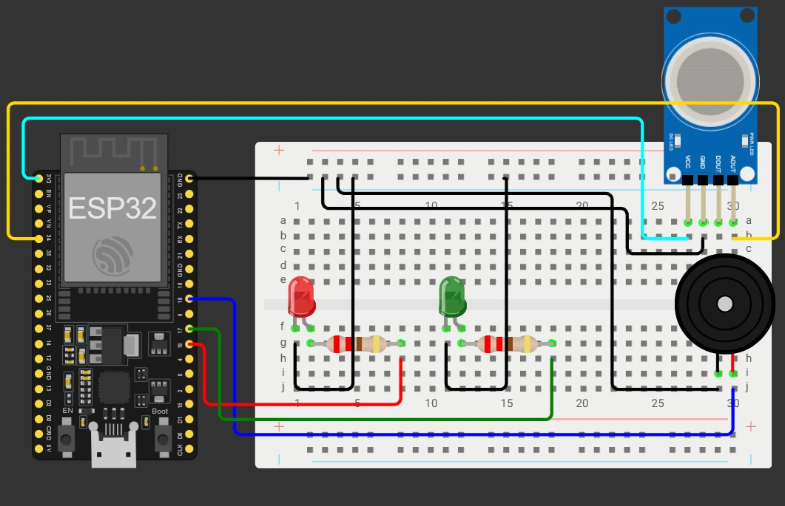

   
   
  
  # Sistem Deteksi Kebocoran Gas Secara Realtime Menggunakan ESP32, FreeRTOS, dan MQTT
  
  
  
  
  
  
  

Kebocoran gas pada ruangan tertutup dapat menimbulkan risiko kebakaran dan ledakan jika tidak terdeteksi sejak dini. Proyek ini membangun sistem deteksi kebocoran gas secara realtime yang memantau konsentrasi gas menggunakan sensor MQ-2 dan memberi peringatan melalui LED, buzzer, serta notifikasi data yang dikirim ke server melalui protokol MQTT. Dengan memanfaatkan FreeRTOS pada board ESP32, pembacaan sensor dan pengiriman data diatur dalam beberapa *task* sehingga proses pemantauan tetap responsif meskipun ada beban tugas lain seperti komunikasi jaringan dan dashboard web.

## Daftar Komponen

| Komponen                    | Kuantitas | Penjelasan                                                                 |
| :-------------------------- | :-------: | :------------------------------------------------------------------------- |
| WEMOS D1 R32 (ESP32)        |   1 pcs   | Board mikrokontroler utama berbasis ESP32 yang mengolah data dan koneksi.  |
| Sensor Gas MQ-2 (modul)     |   1 pcs   | Sensor gas yang mendeteksi LPG, butane, metana, dan asap untuk kebocoran.  |
| Buzzer Piezo Aktif          |   1 pcs   | Buzzer aktif sebagai alarm suara saat terdeteksi kebocoran gas.            |
| LED Merah                   |   1 pcs   | Indikator visual kondisi bahaya (gas terdeteksi).                          |
| LED Hijau                   |   1 pcs   | Indikator visual kondisi normal (sistem standby / aman).                   |
| Resistor 220 Ω              |   2 pcs   | Pembatas arus untuk LED agar tidak rusak saat tersambung ke ESP32.         |
| Breadboard                  |   1 pcs   | Media perakitan rangkaian tanpa perlu menyolder komponen.                  |
| Kabel Jumper Male-to-Male   |   1 pak   | Kabel penghubung antara pin ESP32, sensor, LED, buzzer, dan breadboard.    |

 

  ## Prototype Awal
   **Prototype Pertama Sistem Deteksi Kebocoran Gas Menggunakan Wokwi**
  

  
Pada tahap awal, sistem dibuat sebagai prototype menggunakan Wokwi sebagai simulator ESP32. Fokusnya adalah membuat MVP yang bisa membaca nilai analog dari sensor MQ-2, menyalakan LED hijau saat kondisi normal, lalu mengaktifkan LED merah dan buzzer ketika nilai sensor mendeteksi gas yang melebihi batas atau treshold. Program pada tahap ini masih berjalan dengan satu loop() tunggal tanpa FreeRTOS dan belum terhubung ke MQTT, dan hanya cukup untuk memverifikasi logika deteksi dasar sebelum sistem dikembangkan lebih lanjut.

    
  ### Code Snippet
  https://github.com/SidqiRaafi/Kelompok-3-Mikrokontroler/blob/58384752943e762da85316145fe5a0d2bd0d5b04/docs/code/prototype1.ino#L16-L72
  

 

  ## Prototype RTOS
  

  
Setelah logika dasar berjalan, sistem diubah menggunakan FreeRTOS agar pembacaan sensor tidak terganggu oleh proses lain. Program dipisah menjadi dua task mandiri yaitu GasTask dengan prioritas tertinggi bertugas membaca sensor, menentukan status kebocoran, dan mengendalikan LED dan buzzer untuk deteksi kebocoran, sementara StatusTask berprioritas rendah mengambil data terbaru dari queue dan menampilkannya ke Serial Monitor. Dengan pemisahan ini, alarm tetap responsif meskipun ada beban kerja lain dan pembacaan sensor tidak lagi harus menunggu proses logging selesai menghasilkan sistem yang lebih responsif.

    
  ### Code Snippet
  https://github.com/SidqiRaafi/Kelompok-3-Mikrokontroler/blob/11510bfc183ed84b13ad66a08daaf8a23b0afe15/docs/code/prototype_FreeRTOS.ino#L16-L109
  

 

  ## Prototype + MQTT
  

  
Tahap ini menambahkan MQTTTask di atas program FreeRTOS yang sudah dibuat sebelumnya. Task baru ini mengelola koneksi WiFi di wokwi, koneksi ke broker di broker.emqx.io, dan pengiriman data secara berkala. Data dari sensor tetap dikemas dalam struct GasData dan dikirim lewat gasQueue, tugas MQTTTask cukup mengambil nilai terbaru dari antrian, menyusunnya menjadi payload JSON, lalu mempublikasikannya ke topik gasleak/data di broker menggunakan library tambahan di wokwi yaitu PubSubClient.

disini Prioritas task tetap dipertahankan: GasTask (prioritas 3) fokus pada sensor dan alarm, MQTTTask (prioritas 2) mengurus koneksi jaringan, dan StatusTask (prioritas 1) menangani logging lokal. Hasilnya, sistem berkembang dari alarm lokal sederhana menjadi node sensor yang bisa dimonitor dari dashboard berbasis web yang akan di implementasikan.

  

    
   **Konfigurasi broker agar terhubung ke simulasi di wokwi**  
  
   **Konfigurasi subscriptions di broker**  
  
   **Simulasi di wokwi mengirimkan data ke broker**  
  
   **Data yang diterima di broker** 
  
  

  
### Code Snippet
https://github.com/SidqiRaafi/Kelompok-3-Mikrokontroler/blob/11510bfc183ed84b13ad66a08daaf8a23b0afe15/docs/code/prototype_FreeRTOS%2BMQTT.ino#L16-L177

 

  ## Implementasi menggunakan ESP32
  
  ### Hardware yang digunakan
- Wemos D1 R32 ESP32
- Sensor MQ2
- Active Buzzer
- LED Hijau
- LED Merah
- Breadboard
- 2 × Resistor 220 Ω (pembatas arus LED)
- Breadboard
- Kabel jumper

  ### Dokumentasi Rangkaian
  

  

     
 
  ## Implementasi Web Interface
     
 
  ## Final Product
     
 
  ## Kesimpulan
     
 
  ## Kontributor
- [@Sidqi Raafi Al Fauzan](https://github.com/SidqiRaafi) - 23552011395
- [@Muhammad Rizal Afrizal](https://github.com/Afrizal8) - 23552011376 
- [@Ardika Nurdiansyah](https://github.com/ardikaanurdiansyah) - 23552011311

